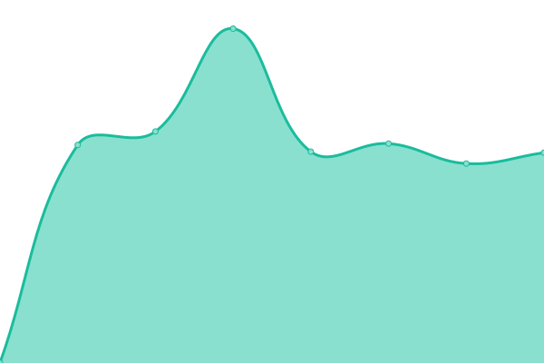
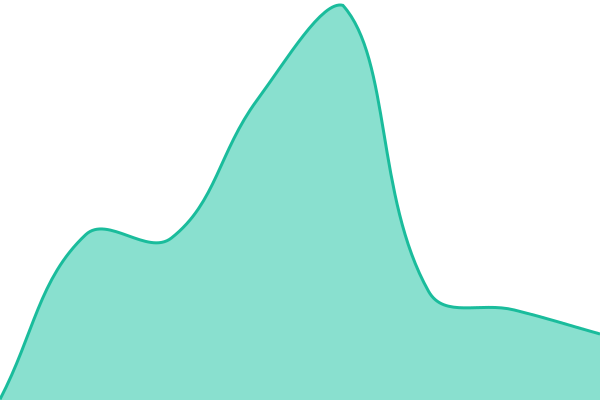
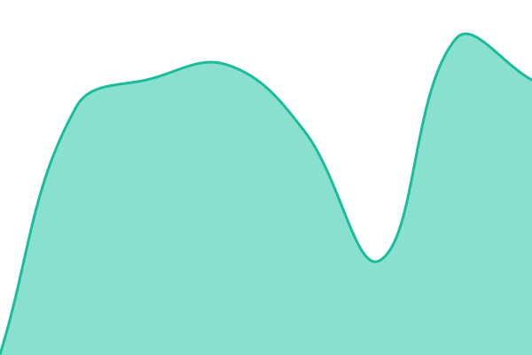
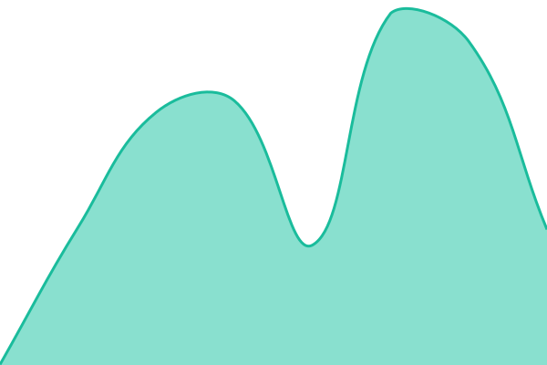
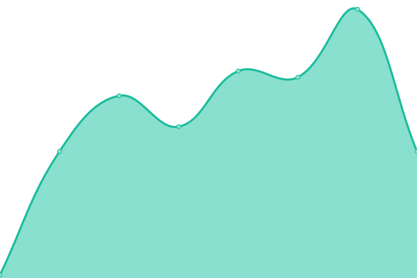
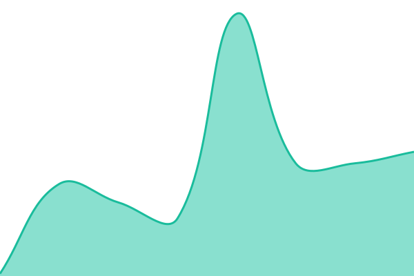
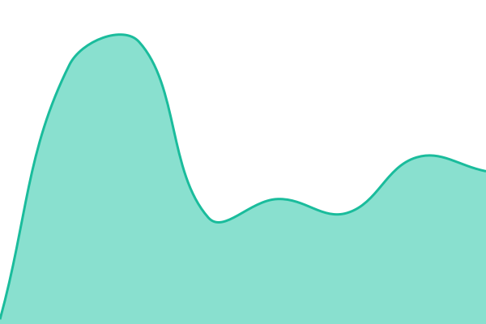

# [📈 Live Status](https://demo.upptime.js.org): <!--live status--> **🟧 Partial outage**

This repository contains the open-source uptime monitor and status page for [santomaharaj](https://demo.upptime.js.org), powered by [Upptime](https://github.com/upptime/upptime).

With [Upptime](https://upptime.js.org), you can get your own unlimited and free uptime monitor and status page, powered entirely by a GitHub repository. We use [Issues](https://github.com/santomaharaj/upp/issues) as incident reports, [Actions](https://github.com/santomaharaj/upp/actions) as uptime monitors, and [Pages](https://demo.upptime.js.org) for the status page.

<!--start: status pages-->
<!-- This summary is generated by Upptime (https://github.com/upptime/upptime) -->
<!-- Do not edit this manually, your changes will be overwritten -->
<!-- prettier-ignore -->
| URL | Status | History | Response Time | Uptime |
| --- | ------ | ------- | ------------- | ------ |
|  ACTIVEMQ_URL | 🟥 Down | [activemq-url.yml](https://github.com/santomaharaj/upp/commits/HEAD/history/activemq-url.yml) | 

 0ms
     
 | 

<a href="https://upp.portals.eu.org/history/activemq-url">0.00%</a>
    

|  APIPORTAL_AZURE | 🟩 Up | [apiportal-azure.yml](https://github.com/santomaharaj/upp/commits/HEAD/history/apiportal-azure.yml) | 

 307ms
     
 | 

<a href="https://upp.portals.eu.org/history/apiportal-azure">100.00%</a>
    

|  APISIX_APIGW_URL | 🟥 Down | [apisix-apigw-url.yml](https://github.com/santomaharaj/upp/commits/HEAD/history/apisix-apigw-url.yml) | 

 515ms
     
 | 

<a href="https://upp.portals.eu.org/history/apisix-apigw-url">0.00%</a>
    

|  APISIX_GRAFANA_URL | 🟥 Down | [apisix-grafana-url.yml](https://github.com/santomaharaj/upp/commits/HEAD/history/apisix-grafana-url.yml) | 

 0ms
     
 | 

<a href="https://upp.portals.eu.org/history/apisix-grafana-url">0.00%</a>
    

|  GRAFANA_URL | 🟩 Up | [grafana-url.yml](https://github.com/santomaharaj/upp/commits/HEAD/history/grafana-url.yml) | 

 1314ms
     
 | 

<a href="https://upp.portals.eu.org/history/grafana-url">100.00%</a>
    

|  JAEGER_URL | 🟥 Down | [jaeger-url.yml](https://github.com/santomaharaj/upp/commits/HEAD/history/jaeger-url.yml) | 

 407ms
     
 | 

<a href="https://upp.portals.eu.org/history/jaeger-url">0.00%</a>
    

|  JENKINS_URL | 🟥 Down | [jenkins-url.yml](https://github.com/santomaharaj/upp/commits/HEAD/history/jenkins-url.yml) | 

 38ms
     
 | 

<a href="https://upp.portals.eu.org/history/jenkins-url">0.00%</a>
    

|  KAFKAUI_URL | 🟥 Down | [kafkaui-url.yml](https://github.com/santomaharaj/upp/commits/HEAD/history/kafkaui-url.yml) | 

 520ms
     
 | 

<a href="https://upp.portals.eu.org/history/kafkaui-url">0.00%</a>
    

|  KEYCLOAK_URL | 🟩 Up | [keycloak-url.yml](https://github.com/santomaharaj/upp/commits/HEAD/history/keycloak-url.yml) | 

 1802ms
     
 | 

<a href="https://upp.portals.eu.org/history/keycloak-url">100.00%</a>
    

|  KONGA_KONG_GUI_URL | 🟩 Up | [konga-kong-gui-url.yml](https://github.com/santomaharaj/upp/commits/HEAD/history/konga-kong-gui-url.yml) | 

 667ms
     
 | 

<a href="https://upp.portals.eu.org/history/konga-kong-gui-url">100.00%</a>
    

|  KUBECOST_URL | 🟥 Down | [kubecost-url.yml](https://github.com/santomaharaj/upp/commits/HEAD/history/kubecost-url.yml) | 

 570ms
     
 | 

<a href="https://upp.portals.eu.org/history/kubecost-url">0.00%</a>
    

|  KUBERNETES_DASHBOARD_URL | 🟥 Down | [kubernetes-dashboard-url.yml](https://github.com/santomaharaj/upp/commits/HEAD/history/kubernetes-dashboard-url.yml) | 

 30503ms
     
 | 

<a href="https://upp.portals.eu.org/history/kubernetes-dashboard-url">0.00%</a>
    

|  LOCALSTACK_AWS_HEALTH_URL | 🟥 Down | [localstack-aws-health-url.yml](https://github.com/santomaharaj/upp/commits/HEAD/history/localstack-aws-health-url.yml) | 

 29ms
     
 | 

<a href="https://upp.portals.eu.org/history/localstack-aws-health-url">0.00%</a>
    

|  PORTAINER_URL | 🟥 Down | [portainer-url.yml](https://github.com/santomaharaj/upp/commits/HEAD/history/portainer-url.yml) | 

 0ms
     
 | 

<a href="https://upp.portals.eu.org/history/portainer-url">0.00%</a>
    

|  RABBITMQ_URL | 🟥 Down | [rabbitmq-url.yml](https://github.com/santomaharaj/upp/commits/HEAD/history/rabbitmq-url.yml) | 

 449ms
     
 | 

<a href="https://upp.portals.eu.org/history/rabbitmq-url">0.00%</a>
    

|  REDOC_SWAGGER_URL | 🟥 Down | [redoc-swagger-url.yml](https://github.com/santomaharaj/upp/commits/HEAD/history/redoc-swagger-url.yml) | 

 0ms
     
 | 

<a href="https://upp.portals.eu.org/history/redoc-swagger-url">0.00%</a>
    

|  SPRINGBOOT_AUTH_HEALTH_CHECK_URL | 🟥 Down | [springboot-auth-health-check-url.yml](https://github.com/santomaharaj/upp/commits/HEAD/history/springboot-auth-health-check-url.yml) | 

 23ms
     
 | 

<a href="https://upp.portals.eu.org/history/springboot-auth-health-check-url">0.00%</a>
    

|  SPRINGBOOT_AUTH_OPENAPI_URL | 🟥 Down | [springboot-auth-openapi-url.yml](https://github.com/santomaharaj/upp/commits/HEAD/history/springboot-auth-openapi-url.yml) | 

 25ms
     
 | 

<a href="https://upp.portals.eu.org/history/springboot-auth-openapi-url">0.00%</a>
    

|  SWAGGERUI_URL | 🟩 Up | [swaggerui-url.yml](https://github.com/santomaharaj/upp/commits/HEAD/history/swaggerui-url.yml) | 

 667ms
     
 | 

<a href="https://upp.portals.eu.org/history/swaggerui-url">100.00%</a>
    

|  VSCODE_URL | 🟩 Up | [vscode-url.yml](https://github.com/santomaharaj/upp/commits/HEAD/history/vscode-url.yml) | 

 748ms
     
 | 

<a href="https://upp.portals.eu.org/history/vscode-url">100.00%</a>
    

|  SOLACE_URL | 🟥 Down | [solace-url.yml](https://github.com/santomaharaj/upp/commits/HEAD/history/solace-url.yml) | 

 481ms
     
 | 

<a href="https://upp.portals.eu.org/history/solace-url">0.00%</a>
    

|  KIALI_URL | 🟥 Down | [kiali-url.yml](https://github.com/santomaharaj/upp/commits/HEAD/history/kiali-url.yml) | 

 514ms
     
 | 

<a href="https://upp.portals.eu.org/history/kiali-url">0.00%</a>
    

|  PROMETHEUS_URL | 🟩 Up | [prometheus-url.yml](https://github.com/santomaharaj/upp/commits/HEAD/history/prometheus-url.yml) | 

 1191ms
     
 | 

<a href="https://upp.portals.eu.org/history/prometheus-url">100.00%</a>
    

|  CURITY_URL | 🟥 Down | [curity-url.yml](https://github.com/santomaharaj/upp/commits/HEAD/history/curity-url.yml) | 

 0ms
     
 | 

<a href="https://upp.portals.eu.org/history/curity-url">0.00%</a>
    

|  WSO2AMCARBON_URL | 🟥 Down | [wso-2-amcarbon-url.yml](https://github.com/santomaharaj/upp/commits/HEAD/history/wso-2-amcarbon-url.yml) | 

 358ms
     
 | 

<a href="https://upp.portals.eu.org/history/wso-2-amcarbon-url">0.00%</a>
    

<!--end: status pages-->

[**Visit our status website →**](https://demo.upptime.js.org)

## 📄 License

- Powered by: [Upptime](https://github.com/upptime/upptime)
- Code: [MIT](./LICENSE) © [santomaharaj](https://demo.upptime.js.org)
- Data in the `./history` directory: [Open Database License](https://opendatacommons.org/licenses/odbl/1-0/)
